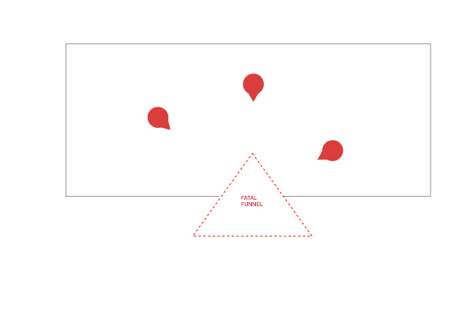
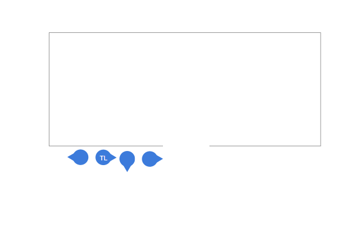
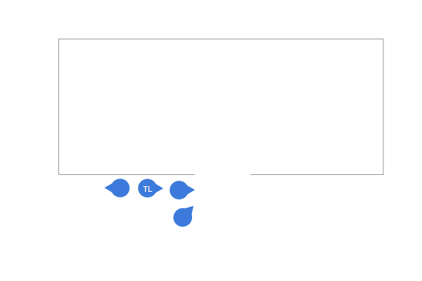
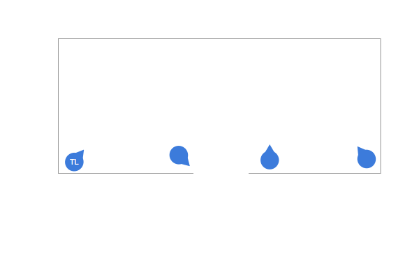
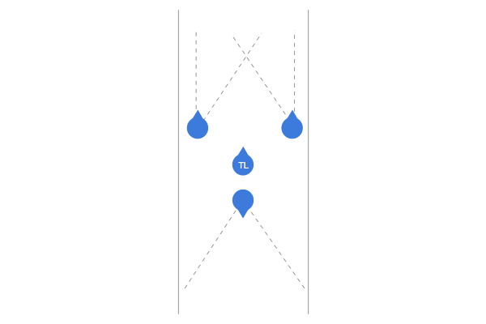
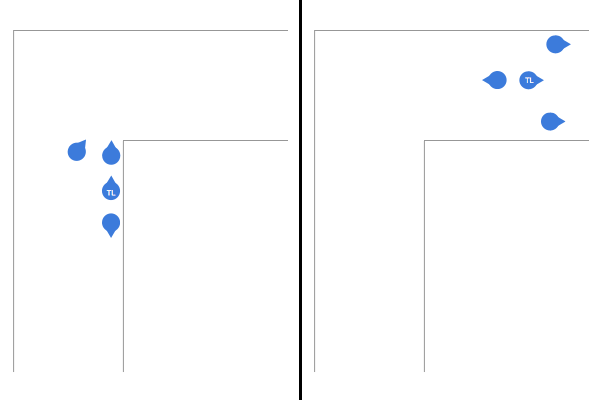
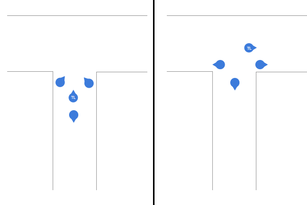

MOUT - Military Operations in Urban Terrain
===================================================

As an infantryman in the RRF you will be expected to be able to perform operations in urban environnments including breaching and clearing structures as well as moving through an urban area safely.

The Fatal Funnel
----------------

.. note::
  The fatal funnel is the area of a breach point that presents the most danger to an entry.  The team must clear this area as quickly as possible to prevent disruption of the breach.  Threats inside the breach will focus fire on this point once entry is made.

.. danger::
  Windows also present danger to a breaching element.  Team members must use caution when approaching or stacking near windows and security should be maintained on windows when possible.

Approaching a Structure
-----------------------

A Team should approach a building in a modified file formation which is adjusted for security and speed of movement. The formation will be modified dynamically by the Team Leader to provide the maximum security during movement to the Breach.

Take special care when the building you are approaching has windows. You should remain below the sight level of the window and keep strong security on the appeture so as to decrease detection probability and minimize the risk of hostiles inside firing out at the element.

Performing a Breach
--------------------

**Setting a Stack**

The first step to breaching is to stack on the door. The first man in the stack will maintain security on the breach while the second, third and fourth men will adjust their sectors of fire to provide maximum security around the element including but not limited to the rear and high side threats.

**Breacher Up**

If a ballistic, explosive or flashbang breach are required the team leader will call "Breacher Up" at which time the number 2 man will maneouver to a wide angle position ahead of the stack from which he is able to effectively deploy the required breaching tools.

.. note::
  Not every breach point will require a Breacher.

**Status Check**

The team leader will do a status check in reverse order by calling out "Status". Each team member in the stack should respond in descending order:

"4 up", "3 up", "2 up", "1 up"

If any team member fails to call ready or says they are "down" then the formation will hold until the issue has been resolved.

**Clearing the Funnel**

The team leader will call breach at which time the team should move to clear the fatal funnel as quickly as possible and begin movement to the points of domination.

Team members should alternate the direction of travel starting from the first man in. There is not a need to coordinate this information before the breach and it should be reactive.

.. warning::
  A common mistake for new soldiers is to think that the breaching team should move through the center of the room. In general you should remain close to the walls during your movement to a point of domination so that you are not exposed to unnecessary angles.

**Moving to a Point of Domination**

.. note::
  A point of domination is a position in a room which provides strong, distinct and unimpeded firing angles in an MOUT environment.

Once the team has made breach the personnel will alternate their direction of travel and move to their points of domination. During movement care should be given to any windows or doors that may hold new threats. One should not cross a door whilst the current room is unclear - instead security should be set on the door to prevent any new targets entering through the breach.

.. note::
  Corner rooms have slightly modified points of domination shown below:
  
  .. image:: ../_static/points_of_domination_2.png
      :align: center

**Performing a status check**

At such a time that the Team Leader believes the room to be secure he will call a status check in which the personnel should respond with their color code. If a soldier needs to reload or administer first aid he will call this out to the team and take a knee. Another member of the team will adjust to cover his sector of fire so security is maintained.

**Short Rooms**

If a room is unable to fit a full team the team leader will call a short room. In this instance only two people should enter with the rest of the team maintaing security outside the breach.

Hallways
--------

Clearing and moving in Hallways requires a different formation to the MOUT stack so that the element has the ability to securely maneouver within a confined linear space.

This formation is called the rolling T and provides good security up and down the hallways as well as allowing for flexible rotation around corners and intersections.

The T is formed with two rifleman on point with the Team Leader in the center and the autorifleman maintaining rear security.

**Clearing an L Shaped Corner with a Rolling T Formation**

To clear an L Shaped Corner in a coridor the team will rearange to maintain security on the point.

On order the pointmen will conduct a high man / low man movement around the corner and engage and eliminate any threats in the halway. Once clear they will push around the corner reassuming the rolling T formation.

Finally the team leader and auto rifleman will fall into position on the far side of the corner and the T will continue movement down the corridor.

**Clearing a T Shaped Intersection with a Rolling T Formation**

To clear a T Shaped Intersection in a corridor the team will move stack on either side of the corridor and hold security on the opposite side of the corridor. The team leader will call a direction of travel once the T has been cleared.

On order the pointmen will move into their respective sides of the T shaped intersection to engage and eliminate any threats present in the corridor.

Once threats have been eliminated the TL and rear security will move into the respective positions of the T formation, the formation will consolidate and the T will continue to move down the corridor in the direction of movement that the Team Leader has chosen.

**Clearing a Four Way Intersection with a Rolling T Formation**

On approaching a Four Way Intersection the pointmen will move to cover the hallways to the left and right of the formation respectively.

The Team Leader and rear security will then cross the hallway and move to their respective positions.

Finally the two pointmen will fall back into the formation in their positions, collapsing in from the side hallways and the T will continue movement.

.. image:: ../_static/rolling_t_intersection_four.png
    :align: center

Clearing Stairs
---------------

When clearing stairs the team should form a stack with the first man maintaining forward security and the second man packed closely maintaining high side rear security to ensure noone is shot from a landing area. The remainder of the team will follow the pointman up the stairs and reassume the necessary formation once the next floor is reached.

Visual Markings for MOUT
-------------------------

MOUT has it's own SOPs for marking positions and buildings to indicate status. If you will be operating in an Urban Terrain during a mission you should equip yourself with the necessary equipment to utilize these markings.

+-------------------+-------------------------------+-------------------+
| Position Type     | Day                           | Night             |
+===================+===============================+===================+
| Friendly Position | Green Smoke                   | IR Strobe         |
+-------------------+-------------------------------+-------------------+
| Enemy Position    | Red Smoke                     | IR Laser "Circle" |
+-------------------+-------------------------------+-------------------+
| Building Cleared  | X on the Map / BLUFOR Tracker | Green Chemlight   |
+-------------------+-------------------------------+-------------------+
| Explosive Device  | E on the Map / BLUFOR Tracker | Red Chemlight     |
+-------------------+-------------------------------+-------------------+
