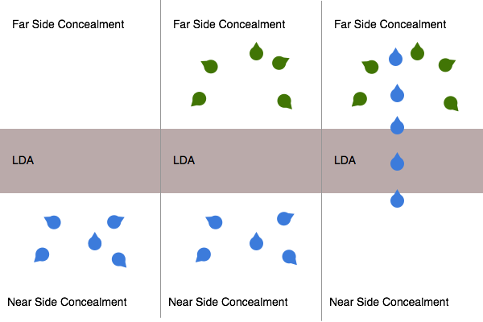
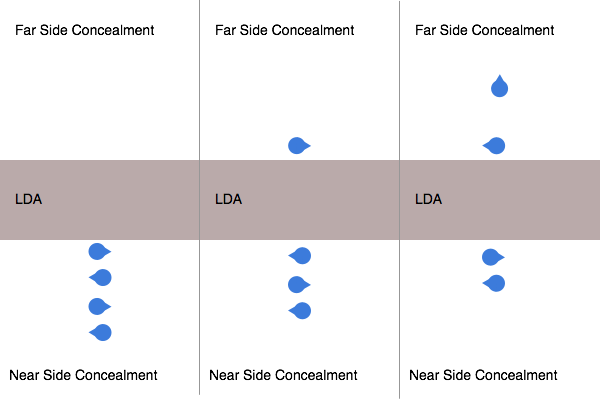

Infantry Battle Drills
==============================

Battle Drills are practiced responses to a given situation that represent the ideal mechanism for the response.

They define our normal response to situations in ideal conditions however, your squad leader will have received training on their use and implementation. As such they tend to fall more as guidelines that are adapted to the situation in the field. You should be prepared for this by having the best possible knowledge of these drills so that you are able to understand how to modify and implement them.

.. note::

  Many Battle Drills are not taught directly at the AIT level. You Squad Leader will train you in more Battle Drills depending on your element's role and his insight into your squad.

React to Contact Drill
-----------------------

This drill is designed to be employed when the team is transitioning ( moving positions as opposed to emplaced in cover and concealment ).

The setting of this battle drill is that a squad is moving as two distinct fire teams, with the squad leader in the rear half or centre of the element.

The first team in the movement receive contact. This team immediately seeks a covered and concealed position to engage the contact with suppressing fire. At this time, the lead team is designated as being decisively engaged; That is to say that they cannot retreat without receiving effective fires from the enemy position.

At this time the second fire team will find a concealed position and avoid decisive engagement.

The squad leader will then manoeuvre via cover or concealment up to the engaged team. He will asses the situation and make an assessment of the correct response at that time.

He will decide between conducting a flanking manoeuvre, breaking contact, or setting up a support by fire position for a platoon level action. The scope of this decision making process is outlined in the Squad Leader training program and is not relevant to this drill.

At this point all of these responses form a part of another battle drill.

Break Contact Rear
--------------------

This drill assumes that the squad is on line, being engaged from the 12 o clock.

The squad leader gives the order for the squad to conduct a break contact rear and selects a team to move first.

At this time the fire team leader of the selected team will order his team to deploy smoke grenades to create a smoke screen between their position and that of the enemy. Care should be taken to check the wind direction so as not to cover the overwatch team's view.

Once the smoke has propagated, the fire team will direct his team to retreat backwards to a covered position if possible, but no further than 1 minutes sprint. From this position the team will emplacement and signal to the squad leader that the second fire team should now retreat.

The second fire team will follow the same practices of deploying smoke and moving backwards.

This drill is a successive bounding manoeuvre, meaning that the teams should end on line with each other and should not retreat past the other team.

Assault on the Flank
---------------------

The flank assault is a technique for assaulting an element where a strategic location is defended by a force that is unable to gain superiority of fires over the squad.

This technique works by the first fire team providing suppressive fire onto the objective whilst the second fire team moves via a concealed route to the flank of the enemy position.

Once the team is set on the enemies flank, the team leader will signal to the squad leader that the team is prepared to assault.

At this time, the squad leader will give the order for the overwatch team to lift or shift fire. This involves moving the field of fire away from the direction of the friendly forces.

Once the overwatch team has shifted their fires, the assaulting element will form on line and push through the objective, coming to a halt on the far edge of the objective to the side on which they assaulted from.

Once the assault team has reached this point, officially called the limit of advance, the overwatch fire team will assault through the objective, complete any actives on the objective such as destroying emplaned equipment and finally ending their advance at the outer edge of the objective on line.

Setting up for a platoon action
--------------------------------

At a Platoon level the same battle drills are used except entire squads are used instead of fireteams.

In this effect a platoon react to contact drill might work like this:

1. The first squad takes contact, becomes decisevly engaged and communicates the contact information whilst suppresing the target

2. Second squad move to flank and push through the contact

3. Second squad assault and move to the line of advance on the objective.

4. First squad move up and push to the line of advance on the objective.

Linear Danger Areas
--------------------

A linear danger area is one where there is an extended, exposed horizontal area, devoid of cover or concealment, where an enemy force would may spot and engage friendly forces. Examples of Linear Danger Areas (LDAs) include roads, runways, large clearings in forests as well as rivers and / or fords.

The Three Methods of Crossing a LDA
-----------------------------------

There are three methods that can be used to cross a LDA. Your element leader will select a method based on the speed and security with which he wishes to cross the LDA. This decision making process is covered in a higher level training and is not documented in this course.

**Deliberate Crossing**

A Deliberate Crossing is the slowest and most secure way of crossing a linear danger area.

This involves one team first setting security on the near side of the LDA, seeking cover and concealment, from which the other team can be covered as they move across the LDA.

At the fireteam level this will be done by creating a gate at the edge of the linear danger area through which the second team will pass to prevent crossing any friendly lines of fire. The size of the gate will be defined by the availability of cover and concealment but could be as small as a few metres or as large as one hundred metres.

Once the gate has been established the second team will cross the LDA and clear the far side. Once the far side is secure the team leader will set up a far side gate, placing his team in cover and concealment so that they can provide security to the crossing team.

Once the far side security has been set the Fire Team Leader will radio the Squad Leader that it is safe for the next team to cross. At this time the near side security team will pick up and move their position across the road.

.. note::
  In the event that the deliberate crossing is part of a larger platoon crossing the near side team will not collapse. They will instead remain in position to allow the platoon to pass through. Once the platoon has passed through the near side security will then collapse across the road and the the squad will become the last in the platoon formation.

**Hasty Crossing**

A Hasty Crossing is a faster but still relatively secure crossing method of crossing an LDA that can be used if there is a low risk of contact and a desire to cover ground faster. The Hasty Crossing is sometimes reffered to as "Scrolling" a road.

The Hast Crossing involves the squad facing alternating directions across the LDA and forming a File. The squad will then approach the edge of the LDA man by man, with the next man moving across when he is shoulder to shoulder with the man behind him.

Once across the soldier will wait for the next man to come across and take his position before moving on to a covered and concealed position.

This is repeated until the entire formation has crossed the LDA.

**Crossing by Force**

Crossing by Force refers the the practise of moving straight across the linear danger area without regards to special security or crossing techniques.

This is used when there is a very high demand for speed and a low chance of contact.

Additional Battle Drills
------------------------

Once you are assigned to an element your Squad Leader will introduce you to more task specific drills during trainings. This will help your squad to become more effective at handling situations that are commonly encountered in your particular discipline.
