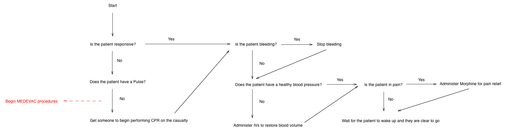

Conditions and Treatments
=========================

ACE adds a wide number of injury and treatment types to the game some of which were detailed in the ACE section of this program.

In this section we will explore the individual treatment options and the decision making tree of a medic.

Treatments
-----------

**Bandages**

ACE provides four different type of bandages - each with a different level of effectiveness on a given wound type.

+-----------------+-----------+-----------+------------+--------------+------------+-------------+-----------------+-----------------+
| Bandage Type    | Abrasions | Avulsions | Contusions | Crush Wounds | Cut Wounds | Lacerations | Velocity Wounds | Puncture Wounds |
+=================+===========+===========+============+==============+============+=============+=================+=================+
| Basic           | Highest   | Low       | Highest    | Medium       | Low        | High        | Low             | Medium          |
+-----------------+-----------+-----------+------------+--------------+------------+-------------+-----------------+-----------------+
| Packing Bandage | Highest   | Highest   | Highest    | Medium       | Lowest     | Low         | Highest         | Low             |
+-----------------+-----------+-----------+------------+--------------+------------+-------------+-----------------+-----------------+
| Bandage         | Highest   | Low       | Highest    | Highest      | Highest    | Highest     | Medium          | Highest         |
+-----------------+-----------+-----------+------------+--------------+------------+-------------+-----------------+-----------------+
| QuikClot        | High      | Lowest    | High       | High         | High       | High        | High            | Medium          |
+-----------------+-----------+-----------+------------+--------------+------------+-------------+-----------------+-----------------+

Bandages are used to pack wounds to reduce bleeding and providing a surface for blood to clot against. Bandages are temporary solutions and wounds will require stitiching to repair permanently.

**Tourniquests**

Tourniquests are pressure devices used to prevent blood flowing into a limb. Due to the nature of the device they are highly effective at bleeding reduction in the limbs stopping bleeding entirely.

The downside of tourniquets is that they put the patient in a lot of pain if they are left on too long - sometimes to the point of rednering the patient unconcious.

**IVs**

ACE provides two types of intravenous bag that can be administered to patients. All IVs are used to help restore blood volume.

The first type is Saline which is used to rapidly provide blood volume to a patient. Saline is a double edged sword as it reduces blood clotting meaning that bleeding can be intesnified by overuse of saline IVs. It is useful for restoring patient's who have lost a little blood or stabilizing patients who are suffering  cardiac failure due to low blood pressure until MEDEVAC arrives.

The second type of IV is a blood transfusion. Blood transfusions restore blood volume and are used in cases of heavy blood loss. Blood transfusions do however require specialized refrigerated transport arrangements meaning that they are not carried by medics in the field and must be kept in vehicles.

.. note:: We do not simulate blood types in game.

**Injected Drugs**

ACE provides three types of Autoinjector for injecting drugs. Drugs are used to manipulate the pulse and to reduce pain levels.

The first and most common autoinjector is Morphine which reduces the pain experienced by the patient. It also has side effects of reducing the patient's blood pressure and heart rate, reducing it by around 20 BPM.

The second autoinjector is Epinephrine - more commonly known as Adrenaline. This drug solely affects the patient's pulse raising it by around 20 BPM.

The third autoinjector is Atropine - a muscle relaxant - which lowers the heart rate of the patient by approximately 20 BPM.

**Surgical Kits**

Surgical Kits allow the bearer ( assuming they are medic qualified ) to sew wounds closed to prevent them from reopening.

Surgical kits are available to all medics in the group - but do require that the user be inside a medical vehicle or facility.

**Personal Aid Kits**

The Personal Aid Kit is a one hit Jesus level wonder of modern medicine that instantly restores the user to full health in every way. This glorious and remarkable achievement can only be performed in a Level 2 medical facility.

Providing Aid to a Patient
--------------------------

The first priority in combat medicine is always to keep the blood inside the body. Bleeding control and management is more important that anything else because without it all other efforts will be wasted.

Therefore when dealing with a casualty you should follow the following process:

